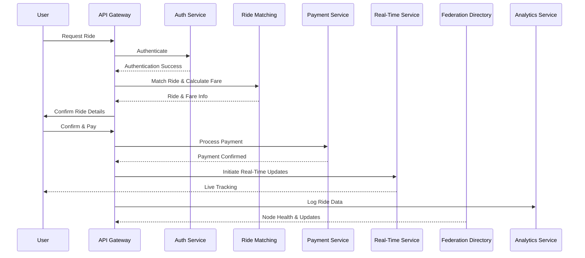

# FDRHQ Organization

Welcome to the official GitHub organization for **FDRHQ**, a decentralized and federated ride-hailing platform designed for global scalability, security, and cost-efficiency.

---

## 🚀 Platform Vision

FDRHQ leverages decentralized technologies, volunteer-operated infrastructure, and open-source principles to deliver secure, efficient, and community-owned ride-hailing services globally.

---

## 📚 Platform Components and Responsibilities

### Core Infrastructure

- **API Gateway** ([fdr-api-gateway](https://github.com/FDRHQ/fdr-api-gateway))  
  *Routing, authentication, rate limiting, load balancing, and logging using Kong.*

- **Authentication & Identity Service**  
  *OAuth, JWT authentication, and user identity validation.*

- **User Management Service**  
  *Registration, user profiles, and preference management.*

- **Ride Matching & Fare Calculation**  
  *Geospatial ride matching using PostgreSQL/PostGIS/H3, fare calculation based on distance, duration, and demand.*

- **Payment Processing Service**  
  *Secure transactions, rider charges, driver payouts (Stripe, PayPal).*

- **Real-Time Communication Service**  
  *Real-time updates, notifications, tracking via WebSockets and MQTT.*

### Supporting Infrastructure

- **Federation Directory & Validator Service**  
  *Cryptographic validation, node health monitoring, global node registry.*

- **Analytics & Monitoring Service**  
  *Logging, tracing (OpenTelemetry/Jaeger), analytics aggregation.*

- **Geo-Spatial Data Service**  
  *Management and efficient querying of spatial data.*

- **Edge Compute Offload Service**  
  *Compute-intensive task handling at edge locations (Cloudflare Workers, Fly.io).*

- **Cache/Key-Value Store Service**  
  *Redis or Cloudflare KV for session management and caching.*

- **Task Scheduling & Background Jobs**  
  *Periodic tasks, job scheduling, asynchronous processing.*

- **Governance & Configuration Management Service**  
  *Community-driven configuration and governance decisions.*

- **Backup & Data Redundancy Service**  
  *Data backup, replication, disaster recovery.*

- **CI/CD Pipeline & DevOps Service**  
  *Automated deployments, testing, and integration (GitHub Actions, GitLab CI).*

- **Security Auditing & Penetration Testing Service**  
  *Regular security assessments and audits.*

---

## 🔄 System Sequence Diagram



---

## ⚙️ Getting Started

Clone individual repositories, follow instructions for local development and deployment:

```bash
git clone https://github.com/FDRHQ/[repository-name].git
```

Setup secrets securely with [Infisical](https://infisical.com):

```bash
curl -fsSL https://infisical.com/install.sh | bash
infisical login
infisical run --env=dev -- docker-compose up --build
```

---

## 🤝 Contributing

We welcome your contributions! Check [CONTRIBUTING.md](CONTRIBUTING.md) in each repository for guidelines.

---

## 📄 License

All repositories under the FDRHQ organization are licensed under the [Apache License 2.0](LICENSE).
